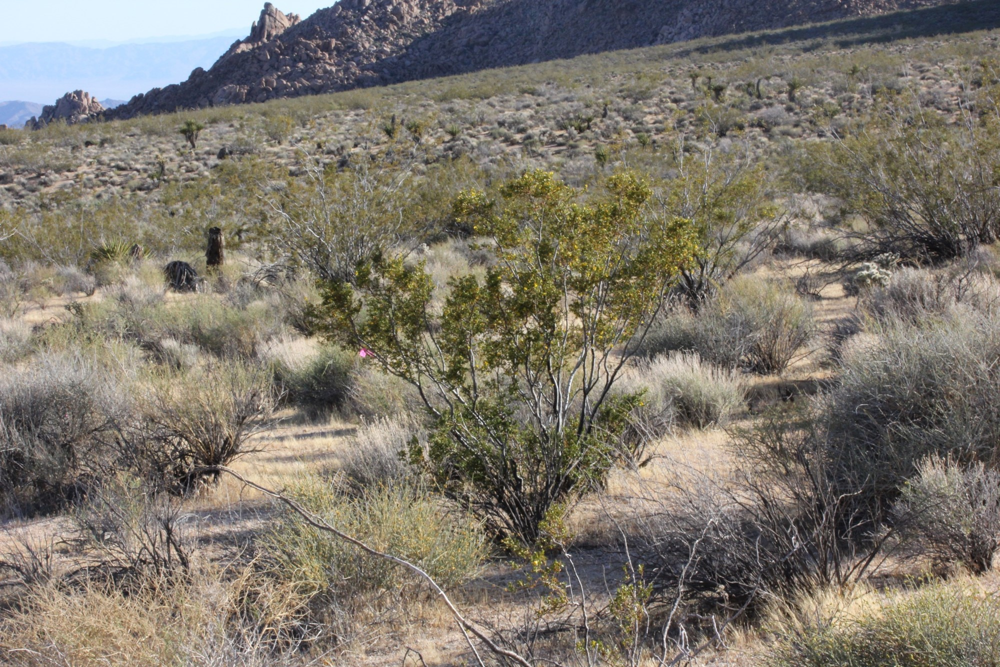

```{r setup, include=FALSE}
knitr::opts_chunk$set(echo = TRUE)
library(dplyr)
library(ggplot2)
library(lubridate)
library(tidyr)
library(vegan)
library(lsmeans)
#source(system.file("utils", "allFit.R", package="lme4"))
library(glmmTMB)
library(cowplot)
library(boot)
source("Scripts/functions.R")
```

#Disentangling the drivers and trade-offs of pollinator-mediated interactions between the foundation shrub Creosote bush (Larrea tridentata) and the annual desert dandelion (Malacothrix glabrata)  

\newline

***

\newline


## Overview
In arid ecosystems shrub facilitation is a critical process driving plant community structure and assembly, which leads to concentrations of annuals beneath the shrub canopies. Pollinator-mediated interactions have fitness consequences for their participants but are a largely unexplored indirect consequence of shrub-annual facilitation. We tested the capacity of the geographically widespread Creosote bush Larrea tridentata to influence the pollination of its annual understory during its phenological shift into spring flowering. In this system, we found that L. tridentata had a positive ecological effect on annual plant cover, as well as the abundance and richness of the arthropod community but that it also had indirect negative effects on pollinator visitation to a representative flowering annual plant which intensified when L. tridentata bloomed. These finding suggest that the net outcome of association with foundation plant species can be positive or negative depending on both the life-history stage of the protégé species tested and on the phenology of the foundation species. There is the capacity for these trade-offs to be widespread and an increasing focus on further documenting these trade-offs will advance both facilitation theory and assessment of selection processes that can drive co-evolutionary relationships between shrubs, annual plants, and pollinators.  

\newline

***

\newline

```{r, graphic, echo= FALSE}

```


# Data wrangling and clean up
This section creates several .csv files that get used later for stats


### Video data clean up
This section takes the raw datas, wrangles it into three formats, adds covariates and outputs the cleaned data as .csv files which re then sourced in later scripts
```{r, video data wrangling}
#data wrangling for video data

#import datasheets
vids <- read.csv("Clean Data/videos_clean.csv")
IDlist <- read.csv("Clean Data/video_repID.csv")
str(vids)

#clean up factor names
vids$Rep <- gsub('\\s+', "", vids$Rep)
vids$microsite <- gsub('\\s+', "", vids$microsite)
vids$flowering <- gsub('\\s+', "", vids$flowering)
vids$flowering <-gsub("post", "bloom", vids$flowering)
vids$flowering <-gsub("Bloom", "bloom", vids$flowering)
vids$microsite <-gsub("Shrub", "shrub", vids$microsite)

#check for correc rep info
vids$id.check <- paste(vids$video.date, vids$plant.id, vids$Rep, vids$microsite, vids$flowering)


#need to know how many videos are empty
id.counts <- count(vids, id.check)
sum(id.counts$n)


#subset out floral visits only ie instances where an insect touched a flower. Other insect uses were extracted from videos but not included in analyses

vids$uniID <- paste(vids$Rep, vids$video.date)
vids$uniID <- gsub('\\s+', "", vids$uniID)

#subset flower visits where insect flies on
flr <- filter(vids, flowers.visits != 0 & flies.on == "Y") 
summary(flr)
str(flr)

#convert time to seconds then decimal time
flr$pos.total.time <- as.POSIXct(strptime(flr$total.time, "%H:%M:%S"))
flr$dec.total.time <- (hour(flr$pos.total.time) * 3600 + minute(flr$pos.total.time) * 60 + second(flr$pos.total.time)) / 3600
flr <- mutate(flr, prop.fl.visited = flowers.visits/flower.fov, prop.un.fl.visited = unique.fl.visited/flower.fov)

counts <- count(flr, uniID)
sum(counts$n)

#count(flr, Rep)
#count(flr, uniID)
#make fill ID list
IDlist$uniID <- paste(IDlist$Rep, IDlist$Day)
IDlist$uniID <- gsub('\\s+', "", IDlist$uniID)

#exclude certain reps. The excluded reps are those where the battery ran out or some disturbance occurred
IDlist <- filter(IDlist, Exclude != "Y")

#count visits per rep
counts <- flr %>% group_by(uniID) %>% summarise(total.visits = n()) 
sum(counts$total.visits)

#count the total number of flowers visited per video
count.fl <- flr %>% group_by(uniID) %>% summarise(total.flowers = sum(flowers.visits)) 

sum(count.fl$total.flowers)

#add reps with zero visits. Need to included videos that received no visits

zeros <- anti_join(IDlist, counts, by = "uniID")
all.data <- bind_rows(zeros, counts)
all.data <- dplyr::select(all.data, uniID, total.visits)

#replace NAs with zeros
all.data$total.visits[is.na(all.data$total.visits)] <- 0
sum(all.data$total.visits)

#join video length
all.data <- IDlist %>% dplyr::select(Length, uniID) %>% right_join(all.data,., by = "uniID")

#join covariates
cov <- read.csv("Clean Data/video_cov.csv")
str(cov)
cov$uniID <- paste(cov$Cam, cov$Date)
cov$uniID <- gsub('\\s+', "", cov$uniID)
all.data <- right_join(cov, all.data, by = "uniID")
sum(all.data$total.visits)

#convert to decimal time to standardize visits
all.data$pos.Length <- as.POSIXct(strptime(all.data$Length, "%H:%M:%S"))
all.data$dec.Length <- (hour(all.data$pos.Length) * 3600 + minute(all.data$pos.Length) * 60 + second(all.data$pos.Length)) / 3600


#plant visits per hour
all.data <- mutate(all.data, visits.per.hour = total.visits/dec.Length)
sum(all.data$total.visits)

#number of flowers visited per hour
all.data <- left_join(all.data, count.fl, by = "uniID")
all.data$total.flowers[is.na(all.data$total.flowers)] <- 0
all.data <- mutate(all.data, flowers.per.hour = total.flowers/dec.Length)
sum(all.data$total.visits)

#add weather data
weather <- read.csv("Clean Data/video_weather.csv")
weather.av <- weather %>% group_by(., Date) %>% summarise(., mean.Solar = mean(Solar), mean.Wind = mean(Wind), mean.MaxWind = mean(Max), mean.Temp = mean(Air.Temperature))
all.data <- right_join(weather.av, all.data, by = "Date")
sum(all.data$total.visits)

#data aggregrated to replicate
write.csv(all.data, "Output Data/byrep_cleaned.csv")
#data left as individual observations
write.csv(flr, "Output Data/byobs_cleaned.csv")


#I also want a dataframe grouped by rtu: Bees, syrphids, bombyliids, leps and others.

#rtu.key is a table to classify the different rtu in datafile into categories

rtu.key <- read.csv("Clean Data/video_rtu_key.csv")
rtu.data <- left_join(rtu.key, flr, by = "highest.rtu")
rtu.data <- dplyr::select(rtu.data, rtu.ag, plant.id, microsite, flowering, video.date, video.length, flower.fov, total.time, flowers.visits, unique.fl.visited, uniID)                    
count.rtu.fl <- rtu.data %>% group_by(uniID, rtu.ag) %>% summarise(total.flowers = sum(flowers.visits), total.visits = n()) 

#add zero rows
#zeros.rtu <- anti_join(IDlist, count.rtu.fl, by = "uniID")
#all.rtu.data <- bind_rows(zeros.rtu, count.rtu.fl)
#all.rtu.data <- dplyr::select(all.rtu.data, uniID, rtu.ag, total.visits, total.flowers)

#need to add the zero count rtu.
#spread, fill in zeros, then gather back
all.rtu.data <- count.rtu.fl
id <- as.data.frame(IDlist$uniID)
id$uniID <- id$`IDlist$uniID`
id <- dplyr::select(id, uniID)
id$syrphid <- 1
id$bee <- 2
id$other <- 3
id$bombylid <- 4
id$lep <- 5
id$honeybee <- 6
id <- gather(id, "rtu", "count", 2:7)
count(id, rtu)

id$join <- paste(id$uniID, id$rtu)
id$test <- 1
all.rtu.data$join <- paste(all.rtu.data$uniID, all.rtu.data$rtu.ag)

test <- dplyr::full_join(id, all.rtu.data, by = "join")

all.rtu <- dplyr::select(test, uniID.x, rtu, total.visits, total.flowers)
all.rtu$total.visits[is.na(all.rtu$total.visits)] <- 0
all.rtu$total.flowers[is.na(all.rtu$total.flowers)] <- 0

all.rtu <- dplyr::rename(all.rtu, uniID = uniID.x)

#join video length
all.rtu <- IDlist %>% dplyr::select(Length, uniID) %>% right_join(all.rtu,., by = "uniID")

#join covariates
all.rtu <- right_join(cov, all.rtu, by = "uniID")

#convert to decimal time to standardize visits
all.rtu$pos.Length <- as.POSIXct(strptime(all.rtu$Length, "%H:%M:%S"))
all.rtu$dec.Length <- (hour(all.rtu$pos.Length) * 3600 + minute(all.rtu$pos.Length) * 60 + second(all.rtu$pos.Length)) / 3600

#plant visits per hour
all.rtu <- mutate(all.rtu, visits.per.hour = total.visits/dec.Length)
all.rtu <- mutate(all.rtu, flowers.per.hour = total.flowers/dec.Length)

all.rtu <- dplyr::select(all.rtu, -SecondaryID, -Cam)

#output rtu level observations (ag. by replicate)
write.csv(all.rtu, "Output Data/rtu_by_rep.csv")
```


### Pan trap data wrangling
This sections takes the long format ID sheet (pantrap_id.csv), converts it into wide format that vegan can use, and outputs the cleaned data as .csv to be sourced in later scripts

```{r, pan trap wrangling}

#by rep
#need new simplified key to reflect species additions
long <- read.csv("Clean Data/pantraps_ID.csv")
long$highest.rtu <- gsub(" ","", long$highest.rtu)

sum(long$Quantity)
#sp.key <- read.csv("Clean Data/species_key.csv")
long$Microsite <- gsub(" ","", long$Microsite)
long$uniID <- paste(long$Date, long$PlantID, long$Microsite)
#long <- inner_join(long, sp.key, by = "highest.rtu")
#for pinned specimens need to collapse & add up the Quantity
long.fil <- dplyr::select(long, uniID, highest.rtu, Quantity)
long.ag <- long.fil %>% group_by(uniID, highest.rtu) %>% summarise(Quantity = sum(Quantity)) 
sum(long.ag$Quantity)

counts <- long.ag %>% group_by(highest.rtu) %>% summarise(Quantity = sum(Quantity))
count(long.ag, highest.rtu)

#count number of specimens of each rtu and write to a table
sp_by_rep <- long %>% group_by(highest.rtu) %>% summarise(Quantity = sum(Quantity))
write.csv(sp_by_rep, "Output Data/pans_sp_by_rep.csv")

#output in long format
write.csv(long.ag, "Output Data/pantraps_long.csv")

#spread into wide format for vegan calculations
wide <- long.ag %>% spread(highest.rtu, Quantity)

#not including damaged specimens in analyses
wide <- dplyr::select(wide, -damaged, -destroyed)

#need to replace all 0 in data frame
wide[is.na(wide)] <- 0


write.csv(wide, "Output Data/pantraps_wide.csv")
```


### Pan trap diversity calculations
This sections calculates diversity indices and exports full env/metadata .csv 

Calculations excluding Melyrid beetles
```{r, diversity calculations}

insects <- read.csv("Output Data/pantraps_wide.csv", header = TRUE)
row.names(insects) <- insects$uniID
insects <- dplyr::select(insects, -X, -uniID)

#filter out Melyrid beetles
insects <- dplyr::select(insects, -Melyridae)
metadata <- read.csv("Clean Data/pantraps_cov.csv", header = TRUE)
metadata <- filter(metadata, species != "buckhorn")
metadata$plant.id <- as.character(metadata$plant.id)
str(metadata)
metadata$uniID <- paste(metadata$date, metadata$plant.id, metadata$treatment)
row.names(metadata) <- metadata$uniID


#check all ids in datasheets are found in the other
#zero.row <- anti_join(metadata, insects, by = "uniID")
#missing <- anti_join(insects, metadata, by = "uniID")
#write.csv(zero.row, "zeroreps.csv")

#check if insects and metadata are the same
all.equal(rownames(insects), rownames(metadata))
#sort into the same order
metadata <- metadata[rownames(insects), ]
#confirm - woo!
all.equal(rownames(insects), rownames(metadata))

#grab and wrangle weather stn data
weather <- read.csv("Clean Data/pantraps_weather.csv")
str(weather)

weather.av <- weather %>% group_by(., date) %>% summarise(., mean.Solar = mean(Solar), mean.Wind = mean(Wind), mean.MaxWind = mean(Max), mean.Temp = mean(Air.Temperature))
metadata <- right_join(weather.av, metadata, by = "date")

#calculate abundances using vegan
metadata$abun <- apply(insects, 1, sum)
#check for total
sum(metadata$abun)
H <- diversity(insects)
simp <- diversity(insects, "simpson")
S <- specnumber(insects)
J <- H/log(S)
metadata$H <- H
metadata$Simpson <- simp
metadata$Species <- S
metadata$Even <- J

summary(metadata)

#no Melyrid beetle output
write.csv(metadata, "Output Data/metadata_nobeetle.csv")
write.csv(insects, "Output Data/wide_nobeetle.csv")
```
Calculations including Melyrid beetles
```{r, div calculations including melyrids}
#with beetles
insects <- read.csv("Output Data/pantraps_wide.csv", header = TRUE)
row.names(insects) <- insects$uniID
insects <- dplyr::select(insects, -X, -uniID, -Zeroes)
#filter out beetles
#insects <- dplyr::select(insects, -Melyridae, -Melyridae.)
metadata <- read.csv("Clean Data/pantraps_cov.csv", header = TRUE)
metadata <- filter(metadata, species != "buckhorn")
metadata$plant.id <- as.character(metadata$plant.id)
str(metadata)
metadata$uniID <- paste(metadata$date, metadata$plant.id, metadata$treatment)
row.names(metadata) <- metadata$uniID


#check all ids in datasheets are found in the other
#zero.row <- anti_join(metadata, insects, by = "uniID")
#missing <- anti_join(insects, metadata, by = "uniID")
#write.csv(zero.row, "zeroreps.csv")
#check if insects and metadata are the same
all.equal(rownames(insects), rownames(metadata))
#sort into the same order
metadata <- metadata[rownames(insects), ]
#confirm - woo!
all.equal(rownames(insects), rownames(metadata))

#grab and wrangle weather stn data
weather <- read.csv("Clean Data/pantraps_weather.csv")
str(weather)

weather.av <- weather %>% group_by(., date) %>% summarise(., mean.Solar = mean(Solar), mean.Wind = mean(Wind), mean.MaxWind = mean(Max), mean.Temp = mean(Air.Temperature))
metadata <- right_join(weather.av, metadata, by = "date")

metadata$abun <- apply(insects, 1, sum)
#check for total
sum(metadata$abun)
H <- diversity(insects)
simp <- diversity(insects, "simpson")
S <- specnumber(insects)
J <- H/log(S)
metadata$H <- H
metadata$Simpson <- simp
metadata$Species <- S
metadata$Even <- J

summary(metadata)

#beetle output
write.csv(metadata, "Output Data/metadata_yesbeetle.csv")
write.csv(insects, "Output Data/wide_yesbeetle.csv")
```
Calculations for only Melyrid beetles
```{r, div calcs only melyrids}
##beetles only
insects <- read.csv("Output Data/pantraps_wide.csv", header = TRUE)
row.names(insects) <- insects$uniID
insects <- dplyr::select(insects, -X, -uniID)
#filter out beetles
insects <- dplyr::select(insects, Melyridae)
metadata <- read.csv("Clean Data/pantraps_cov.csv", header = TRUE)
metadata <- filter(metadata, species != "buckhorn")
metadata$plant.id <- as.character(metadata$plant.id)
str(metadata)
metadata$uniID <- paste(metadata$date, metadata$plant.id, metadata$treatment)
row.names(metadata) <- metadata$uniID

#check if insects and metadata are the same
all.equal(rownames(insects), rownames(metadata))
#sort into the same order
metadata <- metadata[rownames(insects), ]
#confirm - woo!
all.equal(rownames(insects), rownames(metadata))

#grab and wrangle weather stn data
weather <- read.csv("Clean Data/pantraps_weather.csv")
str(weather)

weather.av <- weather %>% group_by(., date) %>% summarise(., mean.Solar = mean(Solar), mean.Wind = mean(Wind), mean.MaxWind = mean(Max), mean.Temp = mean(Air.Temperature))
metadata <- right_join(weather.av, metadata, by = "date")

metadata$abun <- apply(insects, 1, sum)
#check for total
sum(metadata$abun)
H <- diversity(insects)
simp <- diversity(insects, "simpson")
S <- specnumber(insects)
J <- H/log(S)
metadata$H <- H
metadata$Simpson <- simp
metadata$Species <- S
metadata$Even <- J


summary(metadata)

#no beetle output
write.csv(metadata, "Output Data/metadata_onlybeetle.csv")
write.csv(insects, "Output Data/wide_onlybeetle.csv")

```

***
#Statistics and modelling

## Visitation and pollen deposition

### Visitation modelling
Hypothesis testing for visitation. GLMM are computationally difficult so workflow is: Base hypothesis model to test for additive vs. interactive effects of predictors. Then add each covariate the best base model. RTU specific responses require a different dataframe so those analyses are done separately. Very full models are not tractable. AllFit.R started throwing an error so moving from lme4 to glmmTMBB. Support for car::Anova in glmmTMB is in the development version.

```{r, visitation models}
byrep <- read.csv("Output Data/byrep_cleaned.csv")
byrep$repID <- paste(byrep$PlantID, byrep$treatment)
byrep$treatment <- relevel(byrep$treatment, "open")
byrep$flowering <- relevel(byrep$flowering, "pre")

#calculate mean video length
mean(byrep$dec.Length)

#calculate total flower visits and total foraging instances
sum(byrep$total.flowers)
sum(byrep$total.visits)

#should be 925 and 697 - not 930 and 701.
```
Flower visits
```{r, visitation models base}
#base hypothesis testing model
#additive
m1 <- glmmTMB(total.flowers ~ treatment + flowering + flowers.pot + offset(log(dec.Length)) + (1|repID), family = "nbinom2", data = byrep)
summary(m1)

plot(residuals(m1)~predict(m1))
car::Anova(m1, type = 2)


#interactive model

m2 <- glmmTMB(total.flowers ~ treatment * flowering + flowers.pot + offset(log(dec.Length)) + (1|repID),  family = "nbinom2", data = byrep)
summary(m2)
car::Anova(m2, type =3)

null <- glmmTMB(total.flowers ~ flowers.pot + offset(log(dec.Length)) + (1|repID),  family = "nbinom2", data = byrep)
summary(null)

anova(m1,m2, null)
AIC(m1,m2, null)
car::Anova(m2, type = 3)

#model 1 is best fit
```

Foraging instances
```{r, visitation models (foraging)}
#base additive model foraging instances
m3 <- glmmTMB(total.visits ~ treatment + flowering + flowers.pot + offset(log(dec.Length)) + (1|repID), family = "nbinom2", data = byrep)
summary(m3)
car::Anova(m3, type = 2)


#base interactive model
m5 <- glmmTMB(total.visits ~ treatment * flowering + flowers.pot + offset(log(dec.Length)) + (1|repID), family = "nbinom2", data = byrep)
summary(m5)
car::Anova(m5, type = 3)


#null model
null <- glmmTMB(total.visits ~ flowers.pot + offset(log(dec.Length)) + (1|repID), family = "nbinom2", data = byrep)


anova(m3,m5, null)
AIC(m3, m5, null)

ggplot(byrep, aes(flowering, flowers.per.hour)) + geom_boxplot() + facet_grid(~treatment)

```
###Testing importance of covariates
using TMB because glmer will not coverge.
Choosing family:
```{r, visitation covariates}
c1 <- glmmTMB(total.flowers ~ treatment + flowering + flowers.pot + understory.richness+ offset(log(dec.Length)) + (1|repID), family = "nbinom2", data = byrep)
summary(c1)

c1.1 <- glmmTMB(total.flowers ~ treatment + flowering + flowers.pot + understory.richness+ offset(log(dec.Length)) + (1|repID), family = "nbinom1", data = byrep)
summary(c1.1)
AIC(c1, c1.1)
#nbinom2 is better
```
Annual floral density
```{r}
c2 <- glmmTMB(total.flowers ~ treatment + flowering + flowers.pot + het.annual.floral.density + offset(log(dec.Length)) + (1|repID), family = nbinom2(link = "log"), data = byrep)
summary(c2)
car::Anova(c2, type = 2)

c2.nest <- glmmTMB(total.flowers ~ treatment + flowering + flowers.pot + het.annual.floral.density + offset(log(dec.Length)) + (1|PlantID/repID), family = nbinom2(link = "log"), data = byrep)

summary(c2.nest)


c2.v <- glmmTMB(total.visits ~ treatment + flowering + het.annual.floral.density + flowers.pot + offset(log(dec.Length)) + (1|repID), family = nbinom2(link = "log"), data = byrep)
summary(c2.v)
car::Anova(c2.v, type = 2)

q <- glmmTMB(total.visits ~ treatment + flowering + flowers.pot + het.annual.floral.density + offset(log(dec.Length)) + (1|repID), family = nbinom1(link = "log"), data = byrep)
car::Anova(q, type = 2)
AIC(c2.v, q)

c2.vnest <- glmmTMB(total.visits ~ treatment + flowering + flowers.pot + het.annual.floral.density + offset(log(dec.Length)) + (1|PlantID/repID), family = nbinom2(link = "log"), data = byrep)
summary(c2.vnest)

```
Number of blooming shrub neighbours
```{r}
c3 <- glmmTMB(total.flowers ~ treatment + flowering + flowers.pot + het.shrub.blooming.neighbours + offset(log(dec.Length)) + (1|repID), family = "nbinom2", data = byrep)
summary(c3)
car::Anova(c3, type = 2)

c2.v <- glmmTMB(total.visits ~ treatment + flowering + flowers.pot + het.shrub.blooming.neighbours + offset(log(dec.Length)) + (1|repID), family = "nbinom2", data = byrep)
summary(c2.v)
car::Anova(c2.v)
```


### RTU visitation modelling
Models for testing RTU-specificity
```{r, rtu specificity}
byrtu <- read.csv("Output Data/rtu_by_rep.csv")
byrtu$repID <- paste(byrtu$PlantID, byrtu$treatment)
byrtu$treatment <- relevel(byrtu$treatment, "open")
byrtu$flowering <- relevel(byrtu$flowering, "pre")

#Full model (foraging instances)
mFullPQ <- MASS::glmmPQL(total.visits~flowering * rtu * treatment + flowers.pot + het.annual.floral.density + het.shrub.blooming.neighbours + offset(log(dec.Length)), random = ~1|repID, family="quasipoisson", data = byrtu)
car::Anova(mFullPQ, type = 3)

mP1 <- MASS::glmmPQL(total.visits~flowering * rtu + treatment + flowers.pot + het.annual.floral.density + het.shrub.blooming.neighbours + offset(log(dec.Length)), random = ~1|repID, family="quasipoisson", data = byrtu)
car::Anova(mP1, type = 3)


mPt <- MASS::glmmPQL(total.visits~ flowering * rtu +  flowering + flowers.pot + het.annual.floral.density + offset(log(dec.Length)), random = ~1|repID, family="quasipoisson", data = byrtu)
summary(mPt)
car::Anova(mPt, type = 3)
lsmeans(mPt, pairwise~flowering|rtu)


#full model flower visits
mFullPQv <- MASS::glmmPQL(total.flowers~flowering * rtu * treatment + flowers.pot + het.annual.floral.density + het.shrub.blooming.neighbours + offset(log(dec.Length)), random = ~1|repID, family="quasipoisson", data = byrtu)
summary(mFullPQv)
car::Anova(mFullPQv, type = 3)

mQ <- MASS::glmmPQL(total.flowers~flowering * rtu + treatment + flowers.pot + offset(log(dec.Length)), random = ~1|repID, family="quasipoisson", data = byrtu)
summary(mQ)
lsmeans(mQ, pairwise~flowering|rtu, adjust = "Tukey")
car::Anova(mQ, type = 3)


mQt <- MASS::glmmPQL(total.flowers~treatment * rtu + flowering + flowers.pot + offset(log(dec.Length)), random = ~1|repID, family="quasipoisson", data = byrtu)
summary(mQt)

#RTU by microsite not significant


#treatment not significant, pairwaise constrast for syrphids is

```
```{r, rtu plots, warning = F}
str(byrtu)
p <- byrtu %>% group_by(treatment, flowering, rtu) %>% dplyr::summarise(visits = sum(flowers.per.hour))

ggplot(p, aes(treatment, visits)) + geom_bar(aes(fill = rtu), stat = "identity", colour = "black") + facet_grid(~flowering, labeller=labeller(flowering = labels))+ theme_Publication() + xlab("Microsite") + ylab("Total Flowers Visited") + labs(fill="") + theme(legend.text = element_text(size = 16))  + scale_fill_brewer(palette= "Spectral") + scale_fill_manual("", values = c("bee" ="#D53E4F", "bombylid"= "#FC8D59", "honeybee"= "#FEE08B", "lep"= "#D3D3D3", "other"= "#99D594", "syrphid" = "#3288BD"), labels = c("Solitary Bee", "Bombyliidae", "Honeybee", "Lepidoptera", "Other", "Syrphidae"))


```


### Visit duration 
```{r, duration models}
byobs <- read.csv("Output Data/byobs_cleaned.csv")

#observation level rtu data. Need to join simplified rtu to data sheet
cov <- read.csv("Clean Data/video_cov.csv")
#rtu.key <- read.csv("Clean Data/video_rtu_key.csv")
cov$uniID <- paste(cov$Cam, cov$Date)
cov$uniID <- gsub('\\s+', "", cov$uniID)

rtu.data <- right_join(cov, byobs, by = "uniID")
rtu.data <- dplyr::select(rtu.data, plant.id, microsite, flowering.x, video.date, video.length, flower.fov, flowers.pot, total.time, flowers.visits, unique.fl.visited, uniID, dec.total.time)                    
rtu.data$repID <- paste(rtu.data$plant.id, rtu.data$microsite)
rtu.data$microsite <-as.factor(rtu.data$microsite)
rtu.data$microsite <- relevel(rtu.data$microsite, "open")
rtu.data$flowering <- relevel(rtu.data$flowering, "pre")
rtu.data$flowers.pot <- as.numeric(as.character(rtu.data$flowers.pot))
#count.rtu.fl <- rtu.data %>% group_by(uniID, rtu.ag) %>% summarise(total.flowers = sum(flowers.visits), total.visits = n()) 

#viz. dec.total.time is the visit duration
ggplot(rtu.data, aes(microsite, dec.total.time)) + geom_boxplot() + facet_grid(~flowering)
ggplot(rtu.data, aes(flowering, dec.total.time)) + geom_boxplot() + facet_grid(~microsite)
ggplot(rtu.data, aes(dec.total.time)) + geom_density()

#using gamma because continuous and positive, looks like it fits 

m1 <- glmmTMB(dec.total.time ~ flowering + microsite + flowers.pot + (1|repID), family = Gamma(link = "log"), data = rtu.data)
summary(m1)
car::Anova(m1, type =2)
m2 <- glmmTMB(dec.total.time ~ flowering * microsite + flowers.pot + (1|repID), family = Gamma(link = "log"), data = rtu.data)
car::Anova(m2, type = 3)
m3 <- glmmTMB(dec.total.time ~ flowering + microsite + (1|repID), family = Gamma(link = "log"), data = rtu.data)
car::Anova(m3, type = 2)
null <- glmmTMB(dec.total.time ~(1|repID), family = Gamma(link = "log"), data = rtu.data)
anova(m1, m2, m3, null)
AIC(m1, m2, m3, null)

#t1 <- glmmTMB(dec.total.time ~ flowering * rtu.ag  + (1|repID), family = Gamma(link = "log"), data = rtu.data)
#summary(t1)
#convergence issues, not including rtu anyways

#ggplot(rtu.data, aes(microsite, dec.total.time, fill = rtu.ag)) + geom_boxplot() + facet_grid(~flowering)

labels <- c(pre = "Pre-blooming", post = "Blooming", bloom = "Blooming")

#filter(rtu.data, dec.total.time<1.5) %>% ggplot(aes(microsite, dec.total.time, fill = rtu.ag)) + geom_boxplot() + facet_grid(~flowering, labeller=labeller(flowering = labels)) + scale_fill_brewer(palette= "Spectral") + theme_Publication() + xlab("Microsite") + ylab("Duration of visit (decimal time)") + labs(fill="") + theme(legend.text = element_text(size = 16)) + scale_fill_manual("", values = c("bee" ="#D53E4F", "bombylid"= "#FC8D59", "honeybee"= "#FEE08B", "lep"= "#D3D3D3", "other"= "#99D594", "syrphid" = "#3288BD"), labels = c("Solitary Bee", "Bombyliidae", "Honeybee", "Lepidoptera", "Other", "Syrphidae"))

```

###Proportion of unique flowers visited per foraging instance
```{r, proportion }
rtu.data <- mutate(rtu.data, prop.visited = unique.fl.visited/flower.fov)

ggplot(rtu.data, aes(prop.visited, color = flowering)) + geom_density()

source(system.file("other_methods","lsmeans_methods.R",package="glmmTMB"))
m1 <- glmmTMB(prop.visited ~ flowering * microsite + flowers.pot + (1|repID), family = Gamma(link = "log"), data = rtu.data)
summary(m1)
car::Anova(m1, type = 3)
lsmeans(m1, pairwise~flowering*microsite)

m2 <- glmmTMB(prop.visited ~ flowering + microsite + flowers.pot + (1|repID), family = Gamma(link = "log"), data = rtu.data)
summary(m2)
car::Anova(m2, type = 3)

m2null <- glmmTMB(prop.visited ~(1|repID), family = Gamma(link = "log"), data = rtu.data)

anova(m1, m2, m2null)
AIC(m1, m2, m2null)

ggplot(rtu.data, aes(microsite, prop.visited)) + geom_boxplot() + facet_grid(~flowering)

#ggplot(rtu.data, aes(microsite, prop.visited, fill = rtu.ag)) + geom_boxplot() + facet_grid(~flowering, labeller=labeller(flowering = labels)) + scale_fill_brewer(palette= "Spectral") + theme_Publication() + xlab("Microsite") + ylab("Proportion of flowers visited") + labs(fill="") + theme(legend.text = element_text(size = 16)) + scale_fill_manual("", values = c("bee" ="#D53E4F", "bombylid"= "#FC8D59", "honeybee"= "#FEE08B", "lep"= "#D3D3D3", "other"= "#99D594", "syrphid" = "#3288BD"), labels = c("Solitary Bee", "Bombyliidae", "Honeybee", "Lepidoptera", "Other", "Syrphidae"))
```

###Pollen Deposition

```{r, pollen deposition}
counts <- read.csv("Clean Data/Pollen_Corrected.csv")
cov <- read.csv("Clean Data/pollen_cov.csv")
counts$X <- as.numeric(as.character(counts$X))   
counts <- counts %>% replace(is.na(.), 0)
counts <- counts %>% mutate(all.con = rowSums(.[5:18]))
counts <- select(counts, Rep:Het.Grains, all.con)                
counts.ag <- counts %>% group_by(Rep, Slide) %>% summarise(Het = sum(Het.Grains), Con = sum(all.con))             
counts.ag <- counts.ag %>% mutate(., microsite = ifelse(substr(Rep,start = 1, stop = 1) == "S", "shrub", "open"))
counts.ag$Flower <- substr(counts.ag$Slide, 1, 1)

sum(counts.ag$Con)
sum(counts.ag$Het)

counts.ag <- right_join(counts.ag, cov, by = "Rep")

#ag by flower
count.fl <- counts.ag %>% group_by(., Flower) %>% summarise(con = sum(Con))
count.fl$f2 <- count.fl$Flower

count.fl <- count.fl %>%
  separate(Flower, c("Rep", "no"), " ")
counts.fl <- right_join(count.fl, cov, by = "Rep")


#m1 <- MASS::glmmPQL(con~ d.flowers + microsite + dN1, ~1|Rep, family = quasipoisson, data = counts.fl)
#summary(m1)

ggplot(data =counts.ag,(aes(microsite.x, Con))) + geom_boxplot()
ggplot(data =counts.ag,(aes(microsite.x, Het))) + geom_boxplot()
t.test(counts.ag$Con ~ counts.ag$microsite.x)

ggplot(data = counts.ag, (aes(Con))) + geom_freqpoly()
shapiro.test(counts.ag$Con)

counts.ag$Flower <- paste(counts.ag$Rep, counts.ag$Flower)
counts.ag$Sample <- paste(counts.ag$Slide, counts.ag$Rep)
counts.ag$d.S <- counts.ag$d.S %>% replace(is.na(.), 0)

cor.test(counts.ag$Con, counts.ag$Het)

mean(counts.ag$d.S)
mean(counts.ag$dN1)
mean(counts.ag$d.flowers)

m1 <- glmmTMB(Con ~ d.flowers + dN1 + d.S + (1|Rep/Flower), family = "nbinom2", data = counts.ag)
summary(m1)
car::Anova(m1, type = 2)
#try microsites instead

m2 <- glmmTMB(Con ~ d.flowers + dN1 + (1|Rep/Flower), family = "nbinom2", data = counts.ag)
summary(m2)

m3 <- glmmTMB(Con ~ dN1 + (1|Rep/Flower), family = "nbinom2", data = counts.ag)
summary(m3)

null <- glmmTMB(Con ~ (1|Rep/Flower), family = "nbinom2", data = counts.ag)

AIC(m1, m2, m3, null)
anova(m1, m2, m3, null)

m4 <- glmmTMB(Het ~ d.flowers + dN1 + d.S + (1|Rep/Flower), family = "nbinom2", data = counts.ag)
summary(m4)
car::Anova(m4, type = 2)

m5 <- glmmTMB(Het ~ d.flowers + d.S + (1|Rep/Flower), family = "nbinom2", data = counts.ag)
summary(m5)


m6 <- glmmTMB(Het ~ d.S + (1|Rep/Flower), family = "nbinom2", data = counts.ag)
summary(m6)

null <- glmmTMB(Het ~ (1|Rep/Flower), family = "nbinom2", data = counts.ag)

AIC(m4, m5, m6, null)
anova(m4, m5, m6, null)
```
```{r, pollen plots, warning=F}
p3 <- ggplot(counts.ag, aes(d.S, Con)) + geom_point(shape = 1) + geom_smooth(colour = "black", size = 0.5) + geom_jitter(shape = 1) + theme_Publication() + xlab("Distance to Larrea tridentata") + ylab("Conspecific Pollen Deposition")


p4 <- ggplot(counts.ag, aes(d.S, Het)) + geom_point(shape = 1) + geom_smooth(colour = "black", size = 0.5) + geom_jitter(shape = 1) + theme_Publication() + xlab("Distance to Larrea tridentata") + ylab("Heterospecific Pollen Deposition")

plot_grid(p3, p4, labels = c("A", "B"), align = "h")
```


***
##Community level effects

***

### Vegetation Modelling
GLMM for vegetation covariates to test for direct shrub facilitation/background flowering levels

***
Annual Percent Cover
```{r, percent cover}

visits <- read.csv("Output Data/byrep_cleaned.csv")
metadata <- read.csv("Output Data/metadata_nobeetle.csv")

#only care about the veg
visits <- dplyr::select(visits, uniID, treatment, flowering, het.shrub.blooming.neighbours, het.cactus.blooming.neighbours, understory.richness, het.annual.floral.density, PlantID)
visits$flowering <- relevel(visits$flowering, "pre")
metadata$blooming <- relevel(metadata$blooming, "pre")

metadata <- dplyr::select(metadata, uniID, plant.id, treatment, blooming, percent.cover, date)
metadata$repID <- paste(metadata$plant.id, metadata$treatment)
visits$repID <- paste(visits$PlantID, visits$treatment)


#percent.cover
shapiro.test(metadata$percent.cover)
mean(metadata$percent.cover)
sd(metadata$percent.cover)
ggplot(metadata, aes(percent.cover)) + geom_density()

g1.nb <- glmmTMB(percent.cover ~ treatment + blooming + (1|repID), family = "nbinom2", data = metadata)
g1.nb1 <- glmmTMB(percent.cover ~ treatment * blooming + (1|repID), family = "nbinom2", data = metadata)
g1.nb.null <- glmmTMB(percent.cover ~ 1 + (1|repID), family = "nbinom2", data = metadata)

g1.ps <- glmmTMB(percent.cover ~ treatment * blooming + (1|repID), family = "poisson", data = metadata)
summary(g1.ps)
#overdisp_fun(g1.ps)
summary(g1.nb)
summary(g1.nb1)
summary(g1.nb.null)

AIC(g1.ps, g1.nb1)

anova(g1.nb, g1.nb1, g1.nb.null)
AIC(g1.nb, g1.nb1, g1.nb.null)
car::Anova(g1.nb, type = 2)
car::Anova(g1.nb1, type = 3)

#negative binomail with interaction is best fitting model

#posthoc in interaction
ph <- lsmeans(g1.nb1, pairwise~treatment*blooming, adjust="tukey")
summary(ph)

ggplot(metadata, aes(treatment, percent.cover)) + geom_boxplot() + facet_grid(~blooming)

ggplot(metadata, aes(treatment, percent.cover)) + geom_boxplot() + theme_Publication() + ylab("Percent Annual Vegetation Cover") + xlab("Microsite")
ggplot(metadata, aes(treatment, percent.cover)) + geom_boxplot() + theme_Publication() + ylab("Percent Annual Vegetation Cover") + xlab("Microsite") + facet_grid(~blooming,labeller=labeller(blooming = labels))
```

***
Annual Richness

```{r, annual richness}
mean(visits$understory.richness, na.rm = TRUE)
sd(visits$understory.richness, na.rm = TRUE)

shapiro.test(visits$understory.richness)
ggplot(visits, aes(understory.richness)) + geom_density()


g2 <- glmmTMB(understory.richness ~ treatment + flowering + (1|repID), family = poisson(link="log"), data = visits)
g2.2 <- glmmTMB(understory.richness ~ treatment * flowering + (1|repID), family = poisson(link="log"), data = visits)
g2.null <- glmmTMB(understory.richness ~ 1 + (1|repID), family = poisson(link="log"), data = visits)
g2b <- glmmTMB(understory.richness ~ treatment + flowering + (1|repID), family = nbinom2, data = visits)


summary(g2)
summary(g2.2)
summary(g2.null)

anova(g2, g2.null, g2.2, g2b, test = "Chisq")
AIC(g2, g2.2, g2.null, g2b)
car::Anova(g2, type = 2)


#null model is the best fit
shapiro.test(residuals(g2))

ggplot(visits, aes(treatment, understory.richness)) + geom_boxplot() + facet_grid(~flowering, labeller=labeller(flowering = labels)) + theme_Publication() + xlab("Microsite") + ylab("Annual Species Richness")
```

***
Annual Floral Density
number of all blooms in quadrat

```{r, annual floral density}
mean(visits$het.annual.floral.density, na.rm = TRUE)
sd(visits$het.annual.floral.density, na.rm = TRUE)

ggplot(visits, aes(het.annual.floral.density)) + geom_density()

g3.nb <- glmmTMB(het.annual.floral.density ~ flowering * treatment + (1|repID), family = "nbinom2", data = visits)

g3.nb.1 <- glmmTMB(het.annual.floral.density ~ flowering + treatment + (1|repID), family = "nbinom2", data = visits)

g3.nb.null <- glmmTMB(het.annual.floral.density ~ 1 + (1|repID), family = "nbinom2", data = visits)

g3.p <- glmmTMB(het.annual.floral.density ~ 1 + (1|repID), family = "poisson", data = visits)

g3.nb.type1 <- glmmTMB(het.annual.floral.density ~ 1 + (1|repID), family = "nbinom1", data = visits) 

summary(g3.nb)
summary(g3.nb.1)
summary(g3.nb.null)
anova(g3.nb, g3.nb.null, g3.nb.1, g3.p, g3.nb.type1, test = "Chisq")

car::Anova(g3.nb.1, type = 2)
AIC(g3.nb, g3.nb.1, g3.p, g3.nb.type1, g3.nb.null)
#negative binomial type 2, additive model

ggplot(visits, aes(treatment, het.annual.floral.density)) + geom_boxplot() + facet_grid(~flowering, labeller=labeller(flowering = labels)) + theme_Publication() + xlab("Microsite") + ylab("Heterospecific Annual Floral Density")

```

***
Blooming shrub density

```{r, shrub density}
mean(visits$het.shrub.blooming.neighbours, na.rm = TRUE)
sd(visits$het.shrub.blooming.neighbours, na.rm = TRUE)

ggplot(visits, aes(het.shrub.blooming.neighbours)) + geom_density(kernel = "gaussian")

g4.nb <- glmmTMB(het.shrub.blooming.neighbours ~ flowering * treatment + (1|repID), family = "nbinom2", data = visits)

g4.nb.1 <- glmmTMB(het.shrub.blooming.neighbours ~ flowering + treatment + (1|repID), family = "nbinom2",data = visits)

g4.nb.null <- glmmTMB(het.shrub.blooming.neighbours ~ 1 + (1|repID), family = "nbinom2",data = visits)
summary(g4.nb)
summary(g4.nb.1)
summary(g4.nb.null)
anova(g4.nb, g4.nb.null, g4.nb.1, test = "Chisq")
car::Anova(g4.nb.1, type = 2)
AIC(g4.nb, g4.nb.1, g4.nb.null)

ggplot(visits, aes(treatment, het.shrub.blooming.neighbours)) + geom_boxplot() + theme_Publication() + ylab("Blooming Shrubs within 2 m") + xlab("Microsite")   
ggplot(visits, aes(treatment, het.shrub.blooming.neighbours)) + geom_boxplot() + theme_Publication() + ylab("Blooming Shrubs within 2 m") + xlab("Microsite") + facet_grid(~flowering,labeller=labeller(flowering = labels)) 

```

***
Blooming cactus density

```{r, cactus density}
mean(visits$het.cactus.blooming.neighbours, na.rm = TRUE)
sd(visits$het.cactus.blooming.neighbours, na.rm = TRUE)

ggplot(visits, aes(het.cactus.blooming.neighbours)) + geom_density(kernel = "gaussian")

g5.nb <- glmmTMB(het.cactus.blooming.neighbours ~ flowering * treatment + (1|repID), family = "nbinom2", data = visits)


g5.ps <- glmmTMB(het.cactus.blooming.neighbours ~ flowering * treatment + (1|repID), family = poisson(link = "log"), data = visits)
g5.ps.1 <- glmmTMB(het.cactus.blooming.neighbours ~ flowering + treatment + (1|repID), family = poisson(link = "log"), data = visits)
g5.ps.null <- glmmTMB(het.cactus.blooming.neighbours ~ 1 + (1|repID), family = poisson(link ="log"), data = visits)


summary(g5.ps)
summary(g5.ps.1)
summary(g5.ps.null)
anova(g5.nb, g5.ps, g5.ps.null, g5.ps.1, test = "Chisq")
car::Anova(g5.ps.1, type = 2)
AIC(g5.nb, g5.ps, g5.ps.1, g5.ps.null)

#poisson additive is best


ggplot(visits, aes(treatment, het.cactus.blooming.neighbours)) + geom_boxplot() + facet_grid(~flowering, labeller=labeller(flowering = labels)) + theme_Publication() + xlab("Microsite") + ylab("Blooming Cactus Density within 2m")

```

***

### Pan traps

These are models for abundance, species richness, bee abundance and bee richness from pan traps.

***
Arthropod abundance - Melyridae beetles excluded
```{r, arthropod abundance m excluded}
metadata <- read.csv("Output Data/metadata_nobeetle.csv")
metadata$repID <- paste(metadata$plant.id, metadata$treatment)
metadata$blooming <- relevel(metadata$blooming, "pre")
sum(metadata$abun)
str(metadata)

ggplot(data = metadata, aes(abun)) + geom_freqpoly()
mean(metadata$abun)
sd(metadata$abun)
shapiro.test(metadata$abun)
ggplot(data = metadata, aes(treatment, abun)) + geom_boxplot() + facet_grid(~blooming)

m1 <- glmmTMB(abun ~ treatment * blooming + (1|repID), family = "nbinom2", data = metadata)
summary(m1)
#lsmeans(m1, pairwise~blooming*treatment)
car::Anova(m1, type = 3)

m2 <- glmmTMB(abun ~ treatment + blooming + (1|repID), family = "nbinom2", data = metadata)
summary(m2)

m3 <- glmmTMB(abun ~ (1|repID), family = "nbinom2", data = metadata)

m4.nb1 <- glmmTMB(abun ~ treatment + blooming + (1|repID), family = "nbinom1", data = metadata)

m4.nb1.int <- glmmTMB(abun ~ treatment * blooming + (1|repID), family = "nbinom1", data = metadata)

anova(m1, m2, m3, m4.nb1, m4.nb1.int, test = "Chisq")
AIC(m1, m2, m3, m4.nb1, m4.nb1.int)

#looks like nbinom1 (negative binomial type one, additive model)

anova(m4.nb1, m4.nb1.int)
#additive and interactive models are not different - using simpler model

summary(m4.nb1)
car::Anova(m4.nb1, type = 2)
```

***
Including Melyridae beetles
```{r, melyride included}
beetle <- read.csv("Output Data/metadata_yesbeetle.csv")
beetle$repID <- paste(beetle$plant.id, beetle$treatment)
beetle$blooming <- relevel(beetle$blooming, "pre")
sum(beetle$abun)
str(beetle)
sum(beetle$H)

ggplot(data = beetle, aes(abun)) + geom_freqpoly()
mean(beetle$abun)
sd(beetle$abun)

m1 <- glmmTMB(abun ~ blooming + treatment + (1|repID), family = "nbinom2", data = beetle)
summary(m1)

m2 <- glmmTMB(abun ~ blooming * treatment + (1|repID), family = "nbinom2", data = beetle)
summary(m2)

m3 <- glmmTMB(abun ~  (1|repID),family = "nbinom2",  data = beetle)
summary(m3)

m4 <-  glmmTMB(abun ~ blooming + treatment + (1|repID), family = "nbinom1", data = beetle)
summary(m4)  
anova(m1, m2, m3, m4)
AIC(m1, m2, m3, m4)

#one and two are pretty much the same, going with simpler, #4 is best (nbinom1)
car::Anova(m4, type = 2)
```


***

Melyridae only
```{r, melyridae abundance only}
onlybeetle <- read.csv("Output Data/metadata_onlybeetle.csv")
onlybeetle$repID <- paste(onlybeetle$plant.id, onlybeetle$treatment)
onlybeetle$blooming <- relevel(onlybeetle$blooming, "pre")
sum(onlybeetle$abun)
str(beetle)

ggplot(data = onlybeetle, aes(abun)) + geom_freqpoly()
mean(onlybeetle$abun)
sd(onlybeetle$abun)

m1 <- glmmTMB(abun ~ blooming * treatment + (1|repID), family = "nbinom2", data = onlybeetle)

summary(m1)


m2 <- glmmTMB(abun ~ blooming + treatment + (1|repID), family = "nbinom2", data = onlybeetle)

m3 <- glmmTMB(abun ~ (1|repID), family = "nbinom2",data = onlybeetle)


AIC(m1, m2, m3)
anova(m1, m2, m3)

summary(m1)
car::Anova(m1, type = 3)
lsmeans(m1, pairwise~blooming*treatment)


ggplot(metadata, aes(blooming, abun)) + geom_boxplot() + facet_grid(~treatment)


```


***
Arthropod Richness
```{r, arthropod richness}

s1 <- glmmTMB(Species ~ blooming + treatment + (1|repID), family = poisson, data = beetle)
summary(s1)
s1.nb <- glmmTMB(Species ~ blooming + treatment + (1|repID), family = "nbinom1", data = beetle)
summary(s1.nb)
s2 <- glmmTMB(Species ~ blooming * treatment + (1|repID), family = poisson, data = beetle)
summary(s2)
s3 <- glmmTMB(Species ~ (1|repID), family = poisson, data = beetle)
summary(s3)
AIC(s1, s1.nb, s2, s3)
#poisson best here
anova(s1,s2, s3)
car::Anova(s1, type = 2)

ggplot(beetle, aes(blooming, Species)) + geom_boxplot() + facet_grid(~treatment)
ggplot(beetle, aes(treatment, Species)) + geom_boxplot() + facet_grid(~blooming)

```

```{r, species accumulation}
#species accumulation
insects <- read.csv("Output Data/wide_yesbeetle.csv")
row.names(insects) <- insects$X
insects <- select(insects, -X)
plot(specaccum(insects), xlab = "# of samples", ylab = "# of species")
```{r, bees only}

insects <- read.csv("Output Data/wide_yesbeetle.csv")
bees <- select(insects, 5:7,12,14,16,36,37,42,43,49,50,61,64,65,67,72,73,75,87,92,96)


metadata <- read.csv("Clean Data/pantraps_cov.csv", header = TRUE)
metadata <- filter(metadata, species != "buckhorn")
metadata$plant.id <- as.character(metadata$plant.id)
str(metadata)
metadata$uniID <- paste(metadata$date, metadata$plant.id, metadata$treatment)
row.names(metadata) <- metadata$uniID


beemeta <- metadata

beemeta$abun <- apply(bees, 1, sum)
#check for total
sum(beemeta$abun)
H <- diversity(bees)
simp <- diversity(bees, "simpson")
S <- specnumber(bees)
J <- H/log(S)
beemeta$H <- H
beemeta$Simpson <- simp
beemeta$Species <- S
beemeta$Even <- J


t.test(beemeta$Species ~ beemeta$blooming)

library(glmmTMB)
m1 <- glmmTMB(Species ~ treatment + blooming + (1|plant.id), family = "nbinom2", beemeta)
summary(m1)

car::Anova(m1, type = 2)
m2 <- glmmTMB(Species ~ treatment + blooming + (1|plant.id), family = "poisson", beemeta)

summary(m2)
m3 <- glmmTMB(Species ~ treatment * blooming + (1|plant.id), family = "poisson", beemeta)

null <- glmmTMB(Species ~  (1|plant.id), family = "poisson", beemeta)

#poisson is best
AIC(m1, m2, m3, null)
#null model has lowest AIC
car::Anova(m2, type = 2)


#bee abundance

m1 <- glmmTMB(abun ~ treatment + blooming + (1|plant.id), family = "nbinom2", beemeta)
summary(m1)

car::Anova(m1, type = 2)
m2 <- glmmTMB(abun ~ treatment + blooming + (1|plant.id), family = "poisson", beemeta)

summary(m2)
m3 <- glmmTMB(abun ~ treatment * blooming + (1|plant.id), family = "poisson", beemeta)

null <- glmmTMB(abun ~  (1|plant.id), family = "poisson", beemeta)

#poisson is best
AIC(m1, m2, m3, null)
#null model has lowest AIC
car::Anova(m2, type = 2)

```

```

Need to add code for bee abundance and bee diversity. Bee abundance won't change, diversity is unlikely.

###Visitation to L. tridentata
In-situ observation of visitation to L. tridentata, to determine which pollinators were visiting and if visitation was related to flower number and/or height

```{r, larrea visitation}
larrea <- read.csv("Clean Data/larreavisits.csv")
cov <- read.csv("Clean Data/insitu_cov_larrea.csv")
sizes <- read.csv("Clean Data/video_larreadimensions.csv")
cov <- distinct(cov)
cov <- select(cov, -date)
cov$repID <- paste(cov$plant.id, "post")

larrea$repID <- paste(larrea$PlantID, larrea$pre.post)
cov <- inner_join(cov, sizes, by = "plant.id")
cov <- select(cov, -plant.id)
larrea <- left_join(larrea, cov, by = "repID")

#N.FLOWER is only applicable to post. it was just easier to join this way!

count(larrea, pre.post)

#how does floral visitation relate to #flowers
fl <- filter(larrea, part.used == "flower")
fl.count <- fl %>% count(repID)

lar.all <- left_join(cov, fl.count, by = "repID")

#there are 58 because of the wind 

#attach neighbour density
pans <- read.csv("Output Data/metadata_yesbeetle.csv")
pans$repID <- paste(pans$plant.id, pans$blooming)
pans <- filter(pans, blooming == "post" & treatment == "shrub")
lar.all <- left_join(lar.all, pans, by = "repID")

lar.all$n[is.na(lar.all$n)] <- 0

#join video covariates
vid.cov <- read.csv("Clean Data/video_cov.csv")
vid.cov$flowering <- gsub("bloom", "post", vid.cov$flowering)
vid.cov$repID <- paste(vid.cov$PlantID, vid.cov$flowering)
lar.all <- vid.cov %>% filter(flowering == "post" & treatment == "shrub") %>% left_join(lar.all, vid.cov, by = "repID")

ggplot(lar.all, aes(n)) + geom_density()

visitors <- fl %>% group_by(., pre.post, part.used) %>% count(., v.species)
sum(visitors$n)

#modelling
cov <- left_join(cov, fl.count, by = "repID")
cov$n[is.na(cov$n)] <- 0

m1 <- glm(data = cov, family = "quasipoisson"(link="log"), n ~ n.flowers)

summary(m1)
car::Anova(m1)
m2 <- glm(data = cov, family = "quasipoisson"(link="log"), n ~ n.flowers + height)
m3 <- glm(data = cov, family = "quasipoisson"(link="log"), n ~ height)

summary(m2)
summary(m3)
car::Anova(m3, type = 2)

ggplot(cov, aes(n.flowers, n)) + geom_point(shape = 1) + geom_smooth(color = "black", size = 0.5) + theme_Publication() + xlab("Floral abundance") + ylab("Visits per 15 min")

#cor.test(repcounts.all$n.flowers, repcounts.all$width)
cor.test(lar.all$n.flowers, lar.all$height)
#cor.test(repcounts.all$width, repcounts.all$height)
```
***

#Abiotic effects
16 data loggers were placed in shrub/open microsites (8 and 8).
```{r, data loggers, warning = F}
setwd("Clean Data/loggers")
temp <- list.files(pattern="*.csv")
name <- list.files(pattern="*.csv")
datalist <- list()
for (i in 1:length(temp)) {
  ob <- read.csv(temp[i], header = FALSE)    #read in csv
  ob <- ob[-1,] #delete weird first row
  #colnames(ob) <- as.character(unlist(ob[1,]))
  ob <- ob[-1,]

  ob$loggername <- name[i]
  datalist[[i]] <- ob
}

allLoggers <- bind_rows(datalist)
colnames(allLoggers) <- c("1", "date.time", "temp", "light.intensity", "coupler.detached", "coupler.attached", "host.connected", "stopped", "logger.name", "end.of.file", "empty col")

#now for some wrangling
# split day and time column

 
allLoggers <- dplyr::select(allLoggers, -11)  
allLoggers <- separate(allLoggers, date.time, c("Date", "time"), sep = 9) %>% dplyr::select(-1) %>% separate("logger.name", c("plant.id", "treatment", sep = "-")) %>% dplyr::select(Date:light.intensity, plant.id:treatment) %>% separate(plant.id, c("species", "id"), sep = 1)

#delete rows from first days and last days
#delete rows from last day

allLoggers$Date <- gsub(" ","", allLoggers$Date)
allLoggers <- filter(allLoggers, Date != "05/11/17" & Date != "03/17/17" & Date != "03/18/17") 
allLoggers <- filter(allLoggers, Date != "") 
                     
#convert time from 12 to 24 hours
allLoggers$time <- format(strptime(allLoggers$time, "%I:%M:%S %p"), format="%H:%M:%S")

allLoggers$hour <- substr(allLoggers$time,1,2)
allLoggers$temp <- as.numeric(allLoggers$temp)
#EDA

str(allLoggers)


#larrea only

larrea <- filter(allLoggers, species == "L")
dailymax <- larrea %>% group_by(treatment, Date, id) %>% summarise(maxTemp = max(temp))
ggplot(data = dailymax, aes(Date, maxTemp, color = treatment)) + geom_point() 


dailymin <- larrea %>% group_by(treatment, Date, id) %>% summarise(minTemp = min(temp))
ggplot(data = dailymin, aes(Date, minTemp, color = treatment)) + geom_point() 

larrea$temp <- as.numeric(larrea$temp)
larrea$hour <- as.numeric(larrea$hour)
daytime <- filter(larrea, hour >= 9 & hour<21)
daytime <- na.omit(daytime)
nighttime <- filter(larrea, hour >=21 | hour<9)
nighttime <-na.omit(nighttime)
all <- larrea %>% group_by(treatment, Date, id) %>% summarise(meanTemp = mean(temp), varTemp = sd(temp))


meanday <- daytime %>% group_by(treatment, Date, id) %>% summarise(meanTemp = mean(temp), varTemp = sd(temp))

meannight<- nighttime %>% group_by(treatment, Date, id) %>% summarise(meanTemp = mean(temp), varTemp = sd(temp))

str(larrea)

larrea$hour <- as.factor(larrea$hour)

#figure for all
ggplot(data = larrea, aes(hour, ((temp-32)*0.5556))) + geom_boxplot(aes(fill = treatment)) + theme_Publication() + xlab("Hour") + ylab("Temperature in °C") + scale_fill_manual(values=c("#AF955A", "darkgreen"), name = "Microsite")

meannight$treatment <- as.factor(meannight$treatment)
kruskal.test(meannight$meanTemp ~ meannight$treatment)

ggplot(meannight, aes(meanTemp, fill = treatment)) + geom_density()       

#mean nightime temps
meannight$id <- as.factor(meannight$id)
m1 <- glmmTMB(meanTemp ~ treatment + (1|id), family = Gamma(link = "log"), data = meannight)
shapiro.test(resid(m1))
summary(m1)
car::Anova(m1, type =2)

#mean daytime temps
m2 <- glmmTMB(meanTemp ~ treatment + (1|id), family = Gamma(link = "log"), data = meanday)
summary(m2)
car::Anova(m2, type =2)


meanAll <- rbind(meanday, meannight)

#overal temperature variation
m3 <- glmmTMB(varTemp ~ treatment + (1|id), family = Gamma(link = "log"), data = all)
summary(m3)
car::Anova(m3, type = 2)


```

#RII
This code bootstraps 95% confidence intervals. Adapted from code written by Dr. Alex Filazzola https://github.com/afilazzola/CommEcolFunctions

```{r, rii, warning = F}
rii.m <- function(x, j, var)
{
  #parse out shrub and open
  s1 <- subset(x, treatment == "shrub", select=var)
  o1 <- subset(x, treatment == "open", select=var)
  return1 <- (s1 - o1) / (s1+o1)  # Rii formula
  # attach factors
  x1 <- x[seq(1, nrow(x), by = 2),]
  return2 <- cbind(x1[j], return1)
  return2[is.na(return2)] <- 0
  print(return2)
}

rii.b <- function(x, j, var)
{
  #parse out shrub and open
  s1 <- subset(x, flowering == "bloom", select=var)
  o1 <- subset(x, flowering == "pre", select=var)
  return1 <- (s1 - o1) / (s1+o1)  # Rii formula
  # attach factors
  x1 <- x[seq(1, nrow(x), by = 2),]
  return2 <- cbind(x1[j], return1)
  return2[is.na(return2)] <- 0
  print(return2)
}


byrep <- read.csv("Output Data/byrep_cleaned.csv")
metadata <- read.csv("Output Data/metadata_nobeetle.csv")
yesbeetle <- read.csv("Output Data/metadata_yesbeetle.csv")
pre <- filter(byrep, flowering == "pre")
pre <- dplyr::select(pre, Date, mean.Solar, mean.Wind, mean.Temp, PlantID, treatment, flowering, understory.richness, visits.per.hour, flowers.per.hour)
#split into 2 dataframes, rename the visitation columns and then rbind
#there are 2 unmatched reps
pre <- arrange(pre, PlantID)
pre <- filter(pre, PlantID != 266 & PlantID != 275 & PlantID != 276 & PlantID != 196)
pre.visits <- rii.m(pre, c(1:7), 8:10)


post <- filter(byrep, flowering =="bloom")
post <- dplyr::select(post, Date, mean.Solar, mean.Wind, mean.Temp, PlantID, treatment, flowering, understory.richness, visits.per.hour, flowers.per.hour)
post <- arrange(post, PlantID)
post <- filter(post, PlantID != 198)
post <- distinct(post)
post.visits <- rii.m(post, c(1:7), 8:10)

rii.visits <- rbind(pre.visits, post.visits)

#from melyridae excluded pan traps

prepan <- filter(metadata, blooming == "pre")
prepan <- dplyr::select(prepan, date, mean.Solar, mean.Wind, mean.Temp, plant.id, treatment, blooming, abun, percent.cover)
#split into 2 dataframes, rename the visitation columns and then rbind
#there are 2 unmatched reps
prepan <- arrange(prepan, plant.id)

#prepan <- filter(prepan, plant.id != 266 & plant.id != 275 & plant.id != 276 & plant.id != 196)

pre.pan <- rii.m(prepan, c(1:7), 8:9)

postpan <- filter(metadata, blooming =="post")
postpan <- dplyr::select(postpan, date, mean.Solar, mean.Wind, mean.Temp, plant.id, treatment, blooming, abun, percent.cover)
postpan <- arrange(postpan, plant.id)
#postpan <- filter(post, PlantID != 198)
#postpan <- distinct(postpan)
post.pan <- rii.m(postpan, c(1:7), 8:9)

rii.pan <- rbind(pre.pan, post.pan)


pre.beetle <- filter(yesbeetle, blooming == "pre")
pre.beetle <- dplyr::select(pre.beetle, date, mean.Solar, mean.Wind, mean.Temp, plant.id, treatment, blooming, Species)
#split into 2 dataframes, rename the visitation columns and then rbind
#there are 2 unmatched reps
pre.beetle <- arrange(pre.beetle, plant.id)

#prepan <- filter(prepan, plant.id != 266 & plant.id != 275 & plant.id != 276 & plant.id != 196)
pre.beetle <- rii.m(pre.beetle, c(1:7), 8)

post.beetle <- filter(yesbeetle, blooming == "post")
post.beetle <- dplyr::select(post.beetle, date, mean.Solar, mean.Wind, mean.Temp, plant.id, treatment, blooming, Species)
#split into 2 dataframes, rename the visitation columns and then rbind
#there are 2 unmatched reps
post.beetle <- arrange(post.beetle, plant.id)

#prepan <- filter(prepan, plant.id != 266 & plant.id != 275 & plant.id != 276 & plant.id != 196)
post.beetle <- rii.m(post.beetle, c(1:7), 8)

rii.beetle <- rbind(pre.beetle, post.beetle)

#bootstrapping
bootmean <- function(d, i) mean(d[i])

flowers.rii <- boot(rii.visits$flowers.per.hour, bootmean, R=1000, stype="i", strata = rii.visits$PlantID)

rich.rii <- boot(rii.visits$understory.richness, bootmean, R=1000, stype="i", strata = rii.visits$PlantID)
abun.rii <- boot(rii.pan$abun, bootmean, R=1000, stype="i", strata = rii.pan$plant.id)
percent.rii <- boot(rii.pan$percent.cover, bootmean, R=1000, stype="i", strata = rii.pan$plant.id)
rich.arth.rii <- boot(rii.beetle$Species, bootmean, R=1000, stype="i", strata = rii.beetle$plant.id)

ci.flowers <- boot.ci(flowers.rii)
bca.flowers <- ci.flowers$bca

ci.rich <- boot.ci(rich.rii)
bca.rich <- ci.rich$bca

ci.abun <- boot.ci(abun.rii)
bca.abun <- ci.abun$bca

ci.percent <- boot.ci(percent.rii)
bca.percent <- ci.percent$bca

ci.arth <- boot.ci(rich.arth.rii)
bca.arth <- ci.arth$bca

ci <- rbind(bca.flowers, bca.rich, bca.abun, bca.percent, bca.arth)


means <- rbind(flowers.rii$t0, rich.rii$t0, abun.rii$t0, percent.rii$t0, rich.arth.rii$t0)
colnames(means) <- c("means")
row.names(means) <- c("visits", "annual.richness", "abundance", "percent.cover", "arth.rich")

all.boot <- cbind(means, ci )
all.boot <- as.data.frame(all.boot)
all.boot$treatment <- c("microsite")


#blooming contrast
shrub.visits <- filter(byrep, treatment == "shrub")
shrub.visits <- dplyr::select(shrub.visits, Date, mean.Solar, mean.Wind, mean.Temp, PlantID, treatment, flowering, understory.richness, visits.per.hour, flowers.per.hour)
#split into 2 dataframes, rename the visitation columns and then rbind
#there are 2 unmatched reps
shrub.visits <- arrange(shrub.visits, PlantID)
shrub.visits <- filter(shrub.visits, PlantID != 196 & PlantID != "new1" & PlantID != 303 & PlantID != 299)
shrub.visits <- subset(shrub.visits[-43,])

open.visits <- filter(byrep, treatment == "open")
open.visits <- dplyr::select(open.visits, Date, mean.Solar, mean.Wind, mean.Temp, PlantID, treatment, flowering, understory.richness, visits.per.hour, flowers.per.hour)
open.visits <- arrange(open.visits, PlantID)
open.visits <- filter(open.visits, PlantID != 266 & PlantID != "new1" & PlantID != 303 & PlantID != 299 & PlantID != 275 & PlantID != 276)
#open.visits <- subset(open.visits[-43,]) 

rii.shrub.visits <- rii.b(shrub.visits, c(1:7), 8:10)
rii.open.visits <- rii.b(open.visits, c(1:7), 8:10)

rii.bloom.visits <- rbind(rii.shrub.visits, rii.open.visits)

t.test(rii.bloom.visits$flowers.per.hour ~ rii.bloom.visits$treatment)


#from melyridae excluded pan traps

shrub.pan <- filter(metadata, treatment == "shrub")
shrub.pan$flowering <- shrub.pan$blooming
shrub.pan$flowering <- gsub("post", "bloom", shrub.pan$flowering)
shrub.pan <- dplyr::select(shrub.pan, date, mean.Solar, mean.Wind, mean.Temp, plant.id, treatment, flowering, abun, percent.cover)
#split into 2 dataframes, rename the visitation columns and then rbind
#there are 2 unmatched reps
shrub.pan <- arrange(shrub.pan, plant.id)
#at least six mismatches
shrub.pan <- filter(shrub.pan, plant.id != 104 & plant.id != 114 & plant.id != 182 & plant.id != 261 & plant.id != 263 & plant.id != 284 & plant.id != 285& plant.id != 287& plant.id != 301& plant.id != 302& plant.id != 303& plant.id != 299)


open.pan <- filter(metadata, treatment =="open")
open.pan$flowering <- open.pan$blooming
open.pan$flowering <- gsub("post", "bloom", open.pan$flowering)
open.pan <- dplyr::select(open.pan, date, mean.Solar, mean.Wind, mean.Temp, plant.id, treatment, flowering, abun, percent.cover)
open.pan <- arrange(open.pan, plant.id)
#postpan <- filter(post, PlantID != 198)
#postpan <- distinct(postpan)

open.pan <- filter(open.pan, plant.id != 104 & plant.id != 114 & plant.id != 182 & plant.id != 261 & plant.id != 263 & plant.id != 284 & plant.id != 285& plant.id != 287& plant.id != 301& plant.id != 302& plant.id != 303& plant.id != 299)


rii.open.pan <- rii.b(open.pan, c(1:7), 8:9)
rii.shrub.pan <- rii.b(shrub.pan, c(1:7), 8:9)

rii.bloom.pan <- rbind(rii.open.pan, rii.shrub.pan)

#species richness
shrub.beet.pan <- filter(yesbeetle, treatment == "shrub")
shrub.beet.pan$flowering <- shrub.beet.pan$blooming
shrub.beet.pan$flowering <- gsub("post", "bloom", shrub.beet.pan$flowering)
shrub.beet.pan <- dplyr::select(shrub.beet.pan, date, mean.Solar, mean.Wind, mean.Temp, plant.id, treatment, flowering, Species)
#split into 2 dataframes, rename the visitation columns and then rbind
#there are 2 unmatched reps
shrub.beet.pan <- arrange(shrub.beet.pan, plant.id)
#at least six mismatches
shrub.beet.pan <- filter(shrub.beet.pan, plant.id != 104 & plant.id != 114 & plant.id != 182 & plant.id != 261 & plant.id != 263 & plant.id != 284 & plant.id != 285& plant.id != 287& plant.id != 301& plant.id != 302& plant.id != 303& plant.id != 299)


open.beet.pan <- filter(yesbeetle, treatment =="open")
open.beet.pan$flowering <- open.beet.pan$blooming
open.beet.pan$flowering <- gsub("post", "bloom", open.beet.pan$flowering)
open.beet.pan <- dplyr::select(open.beet.pan, date, mean.Solar, mean.Wind, mean.Temp, plant.id, treatment, flowering, Species)
open.beet.pan <- arrange(open.beet.pan, plant.id)
#postpan <- filter(post, PlantID != 198)
#postpan <- distinct(postpan)

open.beet.pan <- filter(open.beet.pan, plant.id != 104 & plant.id != 114 & plant.id != 182 & plant.id != 261 & plant.id != 263 & plant.id != 284 & plant.id != 285& plant.id != 287& plant.id != 301& plant.id != 302& plant.id != 303& plant.id != 299)

rii.open.beet.pan <- rii.b(open.beet.pan, c(1:7), 8)
rii.shrub.beet.pan <- rii.b(shrub.beet.pan, c(1:7), 8)

rii.bloom.species <- rbind(rii.open.beet.pan, rii.shrub.beet.pan)


#flowers.rii <- boot(rii.bloom.visits$flowers.per.hour, bootmean, R=1000, stype="i", strata = rii.bloom.visits$PlantID)

#rich.rii <- boot(rii.bloom.visits$understory.richness, bootmean, R=1000, stype="i", strata = rii.bloom.visits$PlantID)
#abun.rii <- boot(rii.bloom.pan$abun, bootmean, R=1000, stype="i", strata = rii.bloom.pan$plant.id)
#percent.rii <- boot(rii.bloom.pan$percent.cover, bootmean, R=1000, stype="i", strata = rii.bloom.pan$plant.id)
#rich.arth.rii <- boot(rii.bloom.species$Species, bootmean, R=1000, stype="i", strata = rii.bloom.species$plant.id)

#ci.flowers <- boot.ci(flowers.rii)
#bca.flowers <- ci.flowers$bca

#ci.rich <- boot.ci(rich.rii)
#bca.rich <- ci.rich$bca

#ci.abun <- boot.ci(abun.rii)
#bca.abun <- ci.abun$bca

#ci.percent <- boot.ci(percent.rii)
#bca.percent <- ci.percent$bca
#ci.arth <- boot.ci(rich.arth.rii)
#bca.arth <- ci.arth$bca

#ci <- rbind(bca.flowers, bca.rich, bca.abun, bca.percent, bca.arth)


#means.bloom <- rbind(flowers.rii$t0, rich.rii$t0, abun.rii$t0, percent.rii$t0, rich.arth.rii$t0)
#colnames(means.bloom) <- c("means")
#row.names(means.bloom) <- c("visits", "annual.richness", "abundance", "percent.cover", "arth.rich")

#all.boot.bloom <- cbind(means.bloom, ci )
#all.boot.bloom <- as.data.frame(all.boot.bloom)
#all.boot.bloom$treatment <- c("bloom")

#all.boot <- rbind(all.boot, all.boot.bloom)

all.boot$metric <- c("visits", "annual.richness", "abundance", "percent.cover", "arth.rich")# "visits", "annual.richness", "abundance", "percent.cover", "arth.rich")

#all.boot$treatment <- as.factor(all.boot$treatment)
#all.boot$treatment <- relevel(all.boot$treatment, "microsite", "bloom")

all.boot$metric <- as.factor(all.boot$metric)
all.boot$metric <- relevel(all.boot$metric, "visits", "abundance", "arth.rich", "percent.cover", "annual.richness")

#labels
metrics <- c("Floral Visits \n per Hour", "Arthropod \n Abundance", "Arthropod \n Richness", "Percent\n Annual Cover", "Annual Species \n Richness")
labels <- c("microsite" = "Microsite","bloom" ="Blooming")


## calculate separate visitation pre/post by microsite bootstrapped


shrub.visits.rii <- boot(rii.shrub.visits$flowers.per.hour, bootmean, R=10000, stype="i")
open.visits.rii <- boot(rii.open.visits$flowers.per.hour, bootmean, R=10000, stype="i")


shrub.cover.rii <- boot(rii.shrub.pan$percent.cover, bootmean, R=10000, stype="i")
open.cover.rii <- boot(rii.open.pan$percent.cover, bootmean, R=10000, stype="i")

shrub.rich.rii <- boot(rii.shrub.visits$understory.richness, bootmean, R=10000, stype="i")
open.rich.rii <- boot(rii.open.visits$understory.richness, bootmean, R=10000, stype="i")

shrub.abun.rii <- boot(rii.shrub.pan$abun, bootmean, R=10000, stype="i")
open.abun.rii <- boot(rii.open.pan$abun, bootmean, R=10000, stype="i")

shrub.arth.rich.rii <- boot(rii.shrub.beet.pan$Species, bootmean, R=10000, stype="i")
open.arth.rich.rii <- boot(rii.open.beet.pan$Species, bootmean, R=10000, stype="i")


ci.shrub.visits <- boot.ci(shrub.visits.rii)
bca.shrub.visits <- ci.shrub.visits$bca

ci.open.visits <- boot.ci(open.visits.rii)
bca.open.visits <- ci.open.visits$bca

ci.shrub.cover <- boot.ci(shrub.cover.rii)
bca.shrub.cover <- ci.shrub.cover$bca
ci.open.cover <- boot.ci(open.cover.rii)
bca.open.cover <- ci.open.cover$bca

ci.shrub.rich <- boot.ci(shrub.rich.rii)
bca.shrub.rich <- ci.shrub.rich$bca
ci.open.rich <- boot.ci(open.rich.rii)
bca.open.rich <- ci.open.rich$bca

ci.shrub.abun <- boot.ci(shrub.abun.rii)
bca.shrub.abun <- ci.shrub.abun$bca
ci.open.abun <- boot.ci(open.abun.rii)
bca.open.abun <- ci.open.abun$bca

ci.shrub.arth.rich <- boot.ci(shrub.arth.rich.rii)
bca.shrub.arth.rich <- ci.shrub.arth.rich$bca
ci.open.arth.rich <- boot.ci(open.arth.rich.rii)
bca.open.arth.rich <- ci.open.arth.rich$bca


means.all <- rbind(shrub.visits.rii$t0, open.visits.rii$t0,shrub.cover.rii$t0, open.cover.rii$t0, shrub.rich.rii$t0, open.rich.rii$t0, shrub.abun.rii$t0, open.abun.rii$t0, shrub.arth.rich.rii$t0, open.arth.rich.rii$t0)
colnames(means.all) <- c("means")
ci.all <- rbind(bca.shrub.visits, bca.open.visits, bca.shrub.cover, bca.open.cover, bca.shrub.rich, bca.open.rich, bca.shrub.abun, bca.open.abun, bca.shrub.arth.rich, bca.open.arth.rich)


all.new <- cbind(means.all, ci.all)
all.new <- as.data.frame(all.new)

all.new$Microsite <- c("shrub", "open", "shrub", "open","shrub", "open","shrub", "open","shrub", "open")
all.new$metric <- c("visits", "visits", "percent.cover", "percent.cover", "annual.richness", "annual.richness", "arth.abundance", "arth.abundance", "arth.richness", "arth.richness")


all.new$metric <- as.factor(all.new$metric)
all.new$metric <- relevel(all.new$metric, "visits", "arth.abundance", "arth.richness", "percent.cover", "annual.richness")

metrics <- c("Floral Visits \n per Hour", "Arthropod \n Abundance", "Arthropod \n Richness", "Annual Cover", "Annual Species \n Richness")

#summary(a1)
#plot this
library(cowplot)
p1 <- ggplot(all.boot, aes(x=metric, y=means)) + 
  geom_errorbar(aes(ymin=V5, ymax=V6), width=.1) +
  geom_line() +
  geom_point() + scale_x_discrete(limits=c("visits", "abundance", "arth.rich", "percent.cover", "annual.richness"), labels = metrics) + theme_Publication() + theme(axis.text.x=element_text(angle=90, vjust=.5)) + ylab("Relative Interation Index") + xlab("") + geom_hline(aes(yintercept=0))


p2 <- ggplot(all.new, aes(x=metric, y=means, linetype = Microsite)) + geom_errorbar(aes(ymin=V5, ymax=V6), width=.1, position=position_dodge(width=0.3)) + geom_line(position=position_dodge(width=0.3)) + geom_point(position=position_dodge(width=0.3)) + scale_linetype_manual(values=c("twodash", "solid")) + scale_x_discrete(limits=c("visits", "arth.abundance", "arth.richness", "percent.cover", "annual.richness"), labels = metrics) + theme_Publication() + theme(axis.text.x=element_text(angle=90, vjust=.5)) + ylab("") + xlab("") + geom_hline(aes(yintercept=0)) + scale_color_manual(values = c("black", "gray")) + theme(legend.position = c(0.8, 0.05))

plot_grid(p1, p2, labels = c("A", "B"), align = "h")
```


